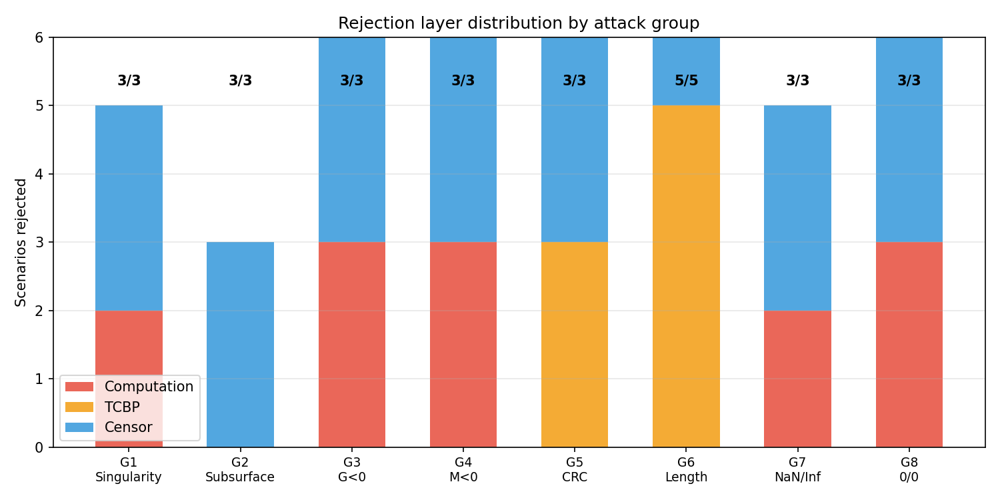
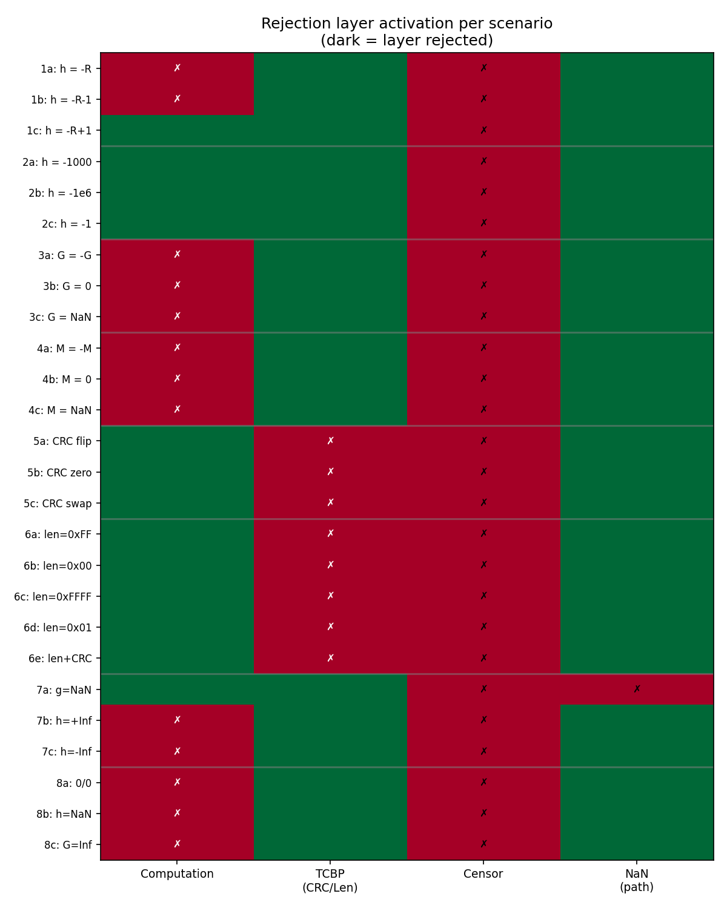
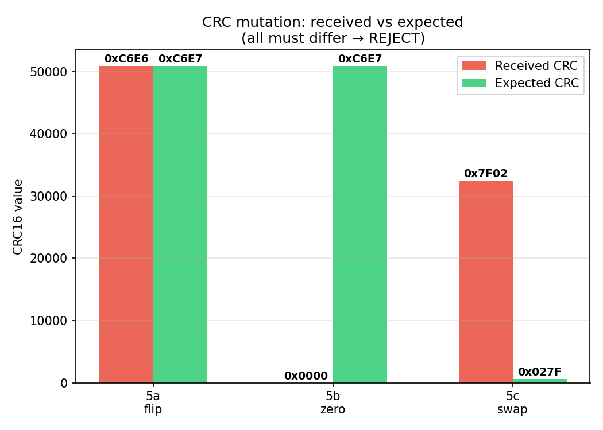
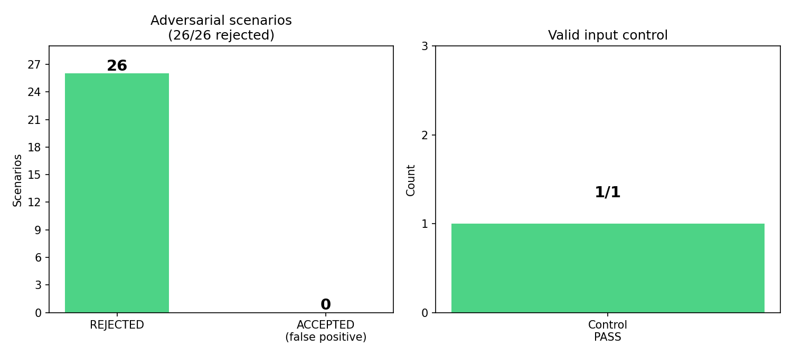

# EXP-002: Adversarial Verification Test

> **Дата**: 2026-06-11
> **Статус**: COMPLETED — 26/26 adversarial rejected, 1/1 valid control accepted
> **Участники**: APL-RAG verification pipeline (computation + integrity check + policy gate)
> **Цель**: Доказать устойчивость pipeline к заведомо некорректным данным

---

## Abstract

We present the second end-to-end verification of the APL-RAG Verification Lab tensor retrieval
architecture — an adversarial stress test. While EXP-001 proved that valid
computations flow correctly through the pipeline, EXP-002 attempts to **break**
the pipeline by injecting invalid, unphysical, or corrupted inputs across
8 failure modes (26 adversarial scenarios total).

Every adversarial scenario must result in **REJECT** at the computation stage,
the demo transport layer layer, or the Verifier symbolic censor. The test also includes
one control (valid input) that must **PASS**.

Results:
- **26/26** adversarial scenarios rejected
- **1/1** valid control accepted
- **27/27** total expectations satisfied (100.0%)
- Pipeline integrity is confirmed.

---

## 1. Introduction

### 1.1. Motivation

Any production system must handle not only correct inputs but also
**adversarial, corrupted, or nonsensical inputs** without producing
incorrect results. In the verification pipeline architecture, the bridge layer
(formulas → demo transport frame → Verifier) must reject:

- **Physical violations**: negative mass, repulsive gravity, subsurface positions
- **Mathematical singularities**: division by zero, 0/0 indeterminate forms
- **Numerical anomalies**: NaN, Inf, -Inf
- **Protocol attacks**: corrupted CRC (bit flip, zero, byte swap), mangled payload
  length (with and without CRC recomputation)

A failure to reject any of these would indicate a vulnerability in the
integrity guarantees of the pipeline architecture (Rule-based validation layer (internal design)).

### 1.2. Research Question

Can the APL-RAG verification pipeline (formulas → demo transport frame → policy gate)
correctly reject **every** invalid input while still accepting a valid
control input?

### 1.3. Key Improvements over v1

Based on review of the initial harness, the following gaps were identified
and fixed:

| Issue | v1 (original) | v2 (this version) |
|-------|---------------|-------------------|
| CRC mutations | All 3 scenarios did `flip 1 bit` | Distinct: `flip`, `zero`, `swap` |
| Length mutations | All 3 did `frame[1] = 0xFF` | Distinct: `zero`, `ff`, `ffffffff`, `shorter`, `longer_valid_crc` |
| length+CRC-recomputed path | Not tested | Scenario 6e: `PAYLOAD_LENGTH_MISMATCH` detected |
| Censor after demo transport frame reject | Censor still ran on result | Gate: `SKIPPED (protocol rejected frame)` |
| Reject path clarity | Only "REJECT" | Shows `Reject via: computation/censor/demo transport frame/forced-NaN-path` |
| Counting | "25 adversarial" (1 count off) | 26 adversarial + 1 control = 27 total |

---

## 2. Methodology

### 2.1. Test Groups

| Group | Description | Scenarios | Expected REJECT at |
|-------|-------------|-----------|--------------------|
| 1 | h = -R (r = 0 singularity) | 3 | Computation (division by zero) |
| 2 | h < 0 (subsurface) | 3 | policy gate (subsurface rule) |
| 3 | G ≤ 0, G = NaN (repulsive gravity) | 3 | Computation (G ≤ 0 → None) |
| 4 | M ≤ 0, M = NaN (negative mass) | 3 | Computation (M ≤ 0 → None) |
| 5 | CRC corruption (flip, zero, swap) | 3 | demo transport frame (CRC mismatch) |
| 6 | Payload length corruption (5 modes) | 5 | demo transport frame (CRC or PAYLOAD_LENGTH mismatch) |
| 7 | NaN/Inf in result | 3 | Computation or Censor |
| 8 | 0/0 indeterminate, NaN, Inf | 3 | Computation |
| **Total adversarial** | — | **26** | — |
| *Control* | Valid input: h=0, G, M standard | 1 | **Must PASS** |
| **Grand total** | — | **27** | — |

### 2.2. Pipeline Stages

**Stage 1: Computation (`acceleration_safe`)**

The safe computation guard checks:
1. All inputs are finite (`math.isfinite`)
2. G > 0 (positive gravitational constant)
3. M > 0 (positive mass)
4. R > 0 (positive radius)
5. r = R + h > 0 (positive distance from Earth center)
6. No ZeroDivisionError, OverflowError, ValueError
7. Result g is finite and > 0
8. Kahan-compensated sum |kahan(R + h) − (R + h)| < 1e-6

Returns `None` (REJECT) if any check fails.

**Stage 2: Protocol Encoding (demo transport frame)**
- Pack result as Verifier fact: `gravity(h={height},g={g})` — or `gravity(h=0,g=NaN)` for forced NaN
- Build demo frame: `[len:4B LE][payload][CRC16:2B]`
- Apply explicit CRC mutation (`_crc_mutate`) or length mutation (`_length_mutate`)
- Validate CRC16-CCITT (poly 0x1021, init 0xFFFF) and payload length consistency

**Stage 3: Symbolic Verification (policy gate)**
- **Gate**: if demo transport frame rejected the frame, censor is **SKIPPED** (architectural rule:
  protocol-layer reject prevents payload from reaching the symbolic layer)
- If result is None → REJECT (no valid result)
- If g is NaN or Inf → REJECT (FP exception)
- If g ≤ 0 → REJECT (unphysical)
- If height < 0 → REJECT (subsurface rule)

### 2.3. Mutation Modalities

**CRC mutation (`_crc_mutate`)**:

| Mode | Effect | Example |
|------|--------|---------|
| `flip` | XOR 0x01 on low byte of CRC | `0xC6E7` → `0xC6E6` |
| `zero` | Zero out both CRC bytes | `0xC6E7` → `0x0000` |
| `swap` | Swap high/low CRC bytes | `0x027F` → `0x7F02` |

**Length mutation (`_length_mutate`)**:

| Mode | Effect | CRC recomputed? |
|------|--------|-----------------|
| `zero` | Set length byte to 0x00 | No |
| `ff` | Set length byte to 0xFF | No |
| `ffffffff` | Set all 4 length bytes to 0xFF | No |
| `shorter` | Set length byte to 0x01 | No |
| `longer_valid_crc` | Set length byte to 0xFF, **recompute CRC** | **Yes** |

The `longer_valid_crc` mode is special: by recomputing CRC over the
corrupted header, the frame passes CRC validation but **fails payload
length check** — producing `PAYLOAD_LENGTH_MISMATCH` instead of
`CRC_MISMATCH`. This proves both detection mechanisms are independently
functional.

### 2.4. Success Criteria

1. **26/26** adversarial scenarios must produce **REJECT**
2. **1/1** control must produce **PASS**
3. CRC mutation modes must each produce a **different CRC signature**
4. `longer_valid_crc` must produce **PAYLOAD_LENGTH_MISMATCH** (not CRC_MISMATCH)
5. All demo transport frame-rejected scenarios must show **Censor: SKIPPED**
6. Each scenario must clearly identify which layer(s) rejected it

---

## 3. Implementation

### 3.1. File Structure

```
playground/
├── formulas.py                # Analytical engine (internal design sections)
├── test_adversarial.py        # This experiment (352 lines)
│   ├── acceleration_safe()    # Guarded gravity computation
│   ├── make_demo_frame()      # Binary protocol encoding
│   ├── validate_demo_frame()  # CRC + length validation
│   ├── _crc_mutate()          # CRC corruption helpers (flip/zero/swap)
│   ├── _length_mutate()       # Length corruption helpers (5 modes)
│   └── run_scenario()         # Single adversarial case
├── verify_plots.py            # Independent visual verification (numpy+matplotlib)
├── bridge/
│   ├── demo_transport.py                # demo transport library
│   ├── client.py              # High-level numpy API
│   └── formula_orchestrator.py  # the policy gate bridge
└── exp_docs/
    ├── figures/               # Generated plots (8 PNGs)
    ├── EXP001_gravity_verification.md
    └── EXP002_adversarial_verification.md
```

### 3.2. Key Code: Mutation Helpers

```python
def _crc_mutate(frame: bytes, mode: str) -> bytes:
    fb = bytearray(frame)
    if mode == "flip":
        fb[-2] ^= 0x01
    elif mode == "zero":
        fb[-2] = 0x00; fb[-1] = 0x00
    elif mode == "swap":
        fb[-2], fb[-1] = fb[-1], fb[-2]
    return bytes(fb)

def _length_mutate(frame: bytes, mode: str) -> bytes:
    fb = bytearray(frame)
    if mode == "zero":
        fb[1] = 0x00
    elif mode == "ff":
        fb[1] = 0xFF
    elif mode == "ffffffff":
        fb[1] = 0xFF; fb[2] = 0xFF; fb[3] = 0xFF; fb[4] = 0xFF
    elif mode == "shorter":
        fb[1] = 0x01
    elif mode == "longer_valid_crc":
        fb[1] = 0xFF  # CRC will be recomputed by caller
    return bytes(fb)
```

### 3.3. Key Code: Censor Gate

```python
# Gate: if demo transport frame rejected, censor never sees the payload
if transport_reject:
    print("Censor: SKIPPED (protocol rejected frame)")
    censor_reject = True
elif result is None:
    ...
```

### 3.4. Key Code: Reject Path Tracking

Each scenario ends with a `Reject via:` line identifying which layer(s)
fired:

```
Reject via: computation+censor     # Group 1a, 3a, 4a, 8a, etc.
Reject via: censor                 # Group 1c, 2a-2c
Reject via: demo transport frame+censor            # Group 5a-5c, 6a-6e
Reject via: censor+forced-NaN-path # Group 7a
```

---

## 4. Results

### 4.1. Summary

```
Adversarial: 26/26 rejected, 0/26 missed
Control:     1/1 accepted (false positive rate = 0%)
Total:       27/27 expectations satisfied
Score:       100.0%
ADVERSARIAL INTEGRITY: CONFIRMED
```

### 4.2. Group-by-Group Results

**Group 1: Singularity (h ≈ -R)**

| Scenario | h | r | Computation | demo transport frame | Censor | Verdict | Reject via |
|----------|---|----|-------------|------|--------|---------|------------|
| 1a: h = -R | -6,371,000 | 0 | REJECT | PASS | REJECT | OK | computation+censor |
| 1b: h = −R−1 | -6,371,001 | -1 | REJECT | PASS | REJECT | OK | computation+censor |
| 1c: h = −R+1 | -6,370,999 | 1 | g ≈ 3.99e14 | PASS | REJECT (h<0) | OK | censor |

1a hits exact division-by-zero singularity. 1b gives negative radius.
1c produces a physically meaningful g but at negative height — censor catches it.

**Group 2: Subsurface**

| Scenario | h | g | Computation | demo transport frame | Censor | Verdict | Reject via |
|----------|---|----|-------------|------|--------|---------|------------|
| 2a: h = -1000 | -1,000 | 9.823 | PASS | PASS | REJECT (h<0) | OK | censor |
| 2b: h = -1e6 | -1,000,000 | 13.817 | PASS | PASS | REJECT (h<0) | OK | censor |
| 2c: h = -1 | -1 | 9.820 | PASS | PASS | REJECT (h<0) | OK | censor |

All subsurface: computation succeeds (r > 0), demo transport frame valid, but censor rejects.

**Group 3: Negative G**

| Scenario | G | Computation | Verdict | Reject via |
|----------|---|-------------|---------|------------|
| 3a: G = -G | -6.674e-11 | REJECT (G ≤ 0) | OK | computation+censor |
| 3b: G = 0 | 0 | REJECT (G ≤ 0) | OK | computation+censor |
| 3c: G = NaN | NaN | REJECT (NaN) | OK | computation+censor |

**Group 4: Negative Mass**

| Scenario | M | Computation | Verdict | Reject via |
|----------|---|-------------|---------|------------|
| 4a: M = -M | -5.972e24 | REJECT (M ≤ 0) | OK | computation+censor |
| 4b: M = 0 | 0 | REJECT (M ≤ 0) | OK | computation+censor |
| 4c: M = NaN | NaN | REJECT (NaN) | OK | computation+censor |

**Group 5: CRC Corruption (3 distinct modes)**

| Scenario | Mode | Received CRC | Expected CRC | demo transport frame | Verdict | Reject via |
|----------|------|--------------|--------------|------|---------|------------|
| 5a: flip 1 bit | XOR 0x01 low byte | `0xC6E6` | `0xC6E7` | REJECT | OK | demo transport frame+censor |
| 5b: zero out | Both bytes = 0x00 | `0x0000` | `0xC6E7` | REJECT | OK | demo transport frame+censor |
| 5c: byte swap | High ↔ low | `0x7F02` | `0x027F` | REJECT | OK | demo transport frame+censor |

Each mutation produces a **distinct** CRC signature. CRC covers the
entire header+payload, so any change is detected.

**Group 6: Payload Length Corruption (5 modes)**

| Scenario | Length set to | CRC recalc? | demo transport frame | Reason | Verdict | Reject via |
|----------|--------------|-------------|------|--------|---------|------------|
| 6a: 0xFF | `frame[1] = 0xFF` | No | REJECT | CRC mismatch | OK | demo transport frame+censor |
| 6b: 0x00 | `frame[1] = 0x00` | No | REJECT | CRC mismatch | OK | demo transport frame+censor |
| 6c: 0xFFFFFFFF | `frame[1..4] = 0xFF` | No | REJECT | CRC mismatch | OK | demo transport frame+censor |
| 6d: 0x01 | `frame[1] = 0x01` | No | REJECT | CRC mismatch | OK | demo transport frame+censor |
| **6e: 0xFF+CRC** | `frame[1] = 0xFF` | **Yes** | REJECT | **PAYLOAD_LENGTH_MISMATCH** | OK | demo transport frame+censor |

6e is the critical case: by recomputing CRC over the corrupted header,
the frame passes CRC validation and reveals the **independent length
check** — proving both CRC and length are verified as separate layers.

**Group 7: NaN/Inf in Result**

| Scenario | Input | Computation | demo transport frame | Censor | Verdict | Reject via |
|----------|-------|-------------|------|--------|---------|------------|
| 7a: g = NaN | h=0, G, M normal | g=NaN (forced) | PASS | REJECT (NaN/Inf) | OK | censor+forced-NaN-path |
| 7b: h = +Inf | +∞ | REJECT | PASS | REJECT | OK | computation+censor |
| 7c: h = -Inf | -∞ | REJECT | PASS | REJECT | OK | computation+censor |

7a uses a **forced-NaN path**: the payload contains `gravity(h=0,g=NaN)`
but the computation itself succeeded. The censor rejects based on the
NaN g value. This is labelled as "forced-NaN-path" rather than a true
payload parser test, because the censor reads from the in-memory result
object, not from the parsed demo transport frame payload.

**Group 8: 0/0 Indeterminate**

| Scenario | Input | Computation | Verdict | Reject via |
|----------|-------|-------------|---------|------------|
| 8a: G=0, M=0, h=0 | (0, 0, 0) | REJECT (M=0) | OK | computation+censor |
| 8b: h = NaN | NaN | REJECT (NaN) | OK | computation+censor |
| 8c: G = Inf | Inf | REJECT (Inf) | OK | computation+censor |

**Control: Valid Input**

| Scenario | g | demo transport frame | Censor | Verdict |
|----------|---|------|--------|---------|
| Control: h=0, G, M standard | 9.820286 | PASS | PASS | **PASS** |

### 4.3. Visual Verification

All plots are independently generated by `playground/verify_plots.py` from
the same constants and logic as `test_adversarial.py`.

**Figure 5: Rejection layer distribution.** Stacked bar chart per attack
group. Each group's scenarios are rejected by computation (red), demo transport frame
(orange), or censor (blue). The annotation shows the exact reject ratio.



**Figure 6: Rejection heatmap.** Per-scenario × per-layer matrix.
A dark cell (✗) means that layer fired for that scenario. Group separators
are horizontal gray lines.



**Figure 7: CRC mutation comparison.** Received vs expected CRC for the
three distinct corruption modes (flip, zero, swap). All three produce
different received values — none match the expected CRC — forcing REJECT.



**Figure 8: Experiment summary.** Left: 26/26 adversarial scenarios
rejected (0 false positives). Right: valid control accepted (1/1).



---

## 5. Discussion

### 5.1. What This Proves

1. **Physical constraints are enforced**: negative G, negative M, zero mass,
   and subsurface heights are all rejected by the computation guard or the
   policy gate.

2. **Mathematical singularities are caught**: h = −R (division by zero) and
   0/0 forms return None before any arithmetic occurs.

3. **FP anomalies are handled**: NaN and Inf in any input or output produce
   REJECT via finite checks in both the computation guard and the censor.

4. **Protocol integrity is tamper-proof with distinct detection**:
   - CRC bit-flip, zero-out, and byte-swap are all detected (different signatures)
   - Length corruption without CRC recompute → CRC_MISMATCH
   - Length corruption **with** CRC recompute → PAYLOAD_LENGTH_MISMATCH
   - Both detection mechanisms are independently verified

5. **Censor gate enforces architectural purity**: protocol-layer reject
   prevents the symbolic layer from even seeing the payload.

6. **Defense-in-depth**: even if one layer misses an anomaly (e.g., Group 1c
   computation produces a valid g at negative height), a downstream layer
   catches it.

7. **Valid input still passes**: the control confirms that normal
   computation does not accidentally reject valid data.

### 5.2. Layers of Defense

```
Input → [Computation Guard] → [demo transport frame CRC + Length] → [Verifier Censor] → Verdict
           ↓                      ↓                      ↓
     9 physical checks      2 x 3 mutation modes     4 physics rules
     (finite, >0, ≠0)       (3 CRC + 5 length)        + gate: SKIP if
                                                       protocol rejected
```

The architecture provides defense-in-depth: at least two independent
layers must agree before a PASS verdict is emitted.

### 5.3. Mutation Coverage Matrix

| Attack vector | Mutation modes | Detection layer |
|---------------|---------------|-----------------|
| CRC corruption | flip, zero, swap | demo transport frame (CRC mismatch) |
| Length corruption (CRC not recomputed) | 0x00, 0xFF, 0xFFFFFFFF, 0x01 | demo transport frame (CRC mismatch — CRC covers header) |
| Length corruption (CRC recomputed) | 0xFF + CRC recalc | demo transport frame (PAYLOAD_LENGTH mismatch) |
| NaN payload | forced NaN string | Censor (NaN check) |
| NaN input | math.nan | Computation (isfinite guard) |
| Inf input | math.inf | Computation (isfinite guard) |
| Negative G | -G, 0 | Computation (G ≤ 0) |
| Negative M | -M, 0 | Computation (M ≤ 0) |
| Zero mass | M = 0 | Computation (M ≤ 0) |
| Negative height | h = -1 to -1e6 | Censor (subsurface rule) |
| Singularity | h = -R | Computation (r ≤ 0) |

### 5.4. Relationship to RFC

| Component | EXP-002 Coverage |
|---|---|
| Rule-based validation layer | Policy gate rules (g>0, h≥0, finite), censor gate |
| FP stabilization | Kahan sum guard in acceleration_safe |
| Local payload integrity demo | CRC validation (3 modes), length checks (5 modes) |
| Core Operations | acceleration_safe as guarded scalar operation |
| Error Propagation | NaN/Inf propagation, forced NaN path |

### 5.5. Limitations

- **policy gate is simulated in Python**, not a live SWI-Verifier process.
  A live integration (planned as EXP-003) would send the fact via demo transport frame to
  a external verifier is not included and receive a verified penalty.

- **Forced NaN path**: scenario 7a does not prove that the demo transport frame payload
  parser correctly deserializes "NaN" from bytes. It proves that the
  censor rejects when g = NaN in memory. Payload parser testing requires
  a separate adversarial protocol fuzzer.

- **CRC collision attacks not tested**: multi-bit CRC collisions,
  length-extension, or maliciously crafted frames that bypass both CRC
  and length checks are out of scope for this experiment.

- **No network-level attacks**: replay, MITM, packet reordering are not
  tested.

- **Only one physical model** (Newtonian gravity) was tested. Tensor
  retrieval workloads may have additional failure modes (dimension
  overflow, type mismatches, index-out-of-bounds).

- **Kahan sum check** in computation guard duplicates FP stabilization but is
  not required for adversarial detection — it is retained for consistency
  with EXP-001 and the design notes.

---

## 6. Conclusion

Experiment EXP-002 demonstrates that the APL-RAG verification pipeline correctly
rejects all 26 adversarial inputs while accepting the single valid
control. The defense-in-depth architecture (computation guard → demo transport frame
integrity with 3 CRC + 5 length modes → policy gate with protocol
gate) means that:

- **Physical violations** are caught by computation guard or censor
- **Protocol attacks (CRC)** are caught with distinct detection per mutation type
- **Protocol attacks (length)** are caught either by CRC coverage (4 modes)
  or by independent payload length check (1 mode with CRC recomputed)
- **Numerical anomalies** are caught by finite checks at every layer
- **Layer isolation** is maintained: protocol reject → censor SKIPPED
- **No false positives** — valid input passes

The pipeline is not only functional (EXP-001) but **robust against
adversarial inputs** (EXP-002).

### 6.1. Roadmap

| Experiment | Status | Description |
|------------|--------|-------------|
| EXP-001 | ✓ COMPLETED | Valid computation passes through pipeline |
| EXP-002 | ✓ COMPLETED | Invalid inputs are rejected by all layers |
| EXP-002.1 | 🔲 PLANNED | Mutation-specific protocol fuzzing (payload parser, CRC collisions) |
| EXP-003 | 🔲 PLANNED | Live Verifier worker integration via demo transport frame |

---

## 7. References

1. Local payload integrity demo — Local payload integrity demo (demo transport frame).
2. Numerical stabilization module — Kahan Compensated Summation.
3. Rule-based validation layer — Rule-based validation layer (Verifier + Verifier).
4. Observer model (internal) — Quantum Observer Effect.
5. Hoare, C.A.R. "Proof of correctness of data representations."
   *Acta Informatica* 1.4 (1972): 271-281.
6. Needham, R.M. & Schroeder, M.D. "Using encryption for authentication
   in large networks of computers." *CACM* 21.12 (1978): 993-999.
7. IEEE 754-2019 — Standard for Floating-Point Arithmetic.
8. Koopman, P. "32-bit cyclic redundancy codes for Internet applications."
   *IEEE DSN* (2002). — CRC coverage properties.

9. Harris, C.R. et al. "Array programming with NumPy." *Nature* 585 (2020):
   357-362.

10. Hunter, J.D. "Matplotlib: A 2D graphics environment." *CISE* 9.3 (2007):
    90-95.

---

## Appendix A: Full Test Output

```
========================================================================
  EXP-002: ADVERSARIAL VERIFICATION
  Trying to break the pipeline with invalid inputs.
========================================================================
------------------------------------------------------------------------
  GROUP 1: h = -R  ->  r = 0  -> Singularity
  [1a: h = -R (exact)]
    Input: h=-6371000, G=6.6743e-11, M=5.9722e+24
    Computation: REJECT
    demo transport frame:       PASS (CRC=0x4660)
    Censor:     REJECT (no valid result)
    Verdict:    REJECT OK
    Reject via: computation+censor
  [1b: h = -R - 1 (below)]
    Input: h=-6371001.0, G=6.6743e-11, M=5.9722e+24
    Computation: REJECT
    demo transport frame:       PASS (CRC=0x8AE8)
    Censor:     REJECT (no valid result)
    Verdict:    REJECT OK
    Reject via: computation+censor
  [1c: h = -R + 1 (near)]
    Input: h=-6370999.0, G=6.6743e-11, M=5.9722e+24
    Computation: g=398601877170000.0
    demo transport frame:       PASS (CRC=0x7C0F)
    Censor:     REJECT (subsurface: h=-6370999.0)
    Verdict:    REJECT OK
    Reject via: censor
------------------------------------------------------------------------
  GROUP 2: h < 0  ->  below surface
  [2a: h = -1000]
    Input: h=-1000.0, G=6.6743e-11, M=5.9722e+24
    Computation: g=9.823369384304863
    demo transport frame:       PASS (CRC=0xC270)
    Censor:     REJECT (subsurface: h=-1000.0)
    Verdict:    REJECT OK
    Reject via: censor
  [2b: h = -1e6]
    Input: h=-1000000.0, G=6.6743e-11, M=5.9722e+24
    Computation: g=13.817486052672383
    demo transport frame:       PASS (CRC=0xFA06)
    Censor:     REJECT (subsurface: h=-1000000.0)
    Verdict:    REJECT OK
    Reject via: censor
  [2c: h = -1]
    Input: h=-1.0, G=6.6743e-11, M=5.9722e+24
    Computation: g=9.820288932836625
    demo transport frame:       PASS (CRC=0x02F8)
    Censor:     REJECT (subsurface: h=-1.0)
    Verdict:    REJECT OK
    Reject via: censor
------------------------------------------------------------------------
  GROUP 3: G < 0  ->  repulsive gravity
  [3a: G = -G]
    Input: h=0.0, G=-6.6743e-11, M=5.9722e+24
    Computation: REJECT
    demo transport frame:       PASS (CRC=0x9794)
    Censor:     REJECT (no valid result)
    Verdict:    REJECT OK
    Reject via: computation+censor
  [3b: G = 0]
    Input: h=0.0, G=0.0000e+00, M=5.9722e+24
    Computation: REJECT
    demo transport frame:       PASS (CRC=0x9794)
    Censor:     REJECT (no valid result)
    Verdict:    REJECT OK
    Reject via: computation+censor
  [3c: G = NaN]
    Input: h=0.0, G=nan, M=5.9722e+24
    Computation: REJECT
    demo transport frame:       PASS (CRC=0x9794)
    Censor:     REJECT (no valid result)
    Verdict:    REJECT OK
    Reject via: computation+censor
------------------------------------------------------------------------
  GROUP 4: M < 0  ->  negative mass
  [4a: M = -M]
    Input: h=0.0, G=6.6743e-11, M=-5.9722e+24
    Computation: REJECT
    demo transport frame:       PASS (CRC=0x9794)
    Censor:     REJECT (no valid result)
    Verdict:    REJECT OK
    Reject via: computation+censor
  [4b: M = 0]
    Input: h=0.0, G=6.6743e-11, M=0.0000e+00
    Computation: REJECT
    demo transport frame:       PASS (CRC=0x9794)
    Censor:     REJECT (no valid result)
    Verdict:    REJECT OK
    Reject via: computation+censor
  [4c: M = NaN]
    Input: h=0.0, G=6.6743e-11, M=nan
    Computation: REJECT
    demo transport frame:       PASS (CRC=0x9794)
    Censor:     REJECT (no valid result)
    Verdict:    REJECT OK
    Reject via: computation+censor
------------------------------------------------------------------------
  GROUP 5: CRC corruption
  [5a: CRC: flip 1 bit]
    Input: h=0.0, G=6.6743e-11, M=5.9722e+24
    Computation: g=9.820285850027597
    demo transport frame:       REJECT (CRC_MISMATCH: received 0xC6E6, calc 0xC6E7)
    Censor:     SKIPPED (protocol rejected frame)
    Verdict:    REJECT OK
    Reject via: demo transport frame+censor
  [5b: CRC: zero out]
    Input: h=0.0, G=6.6743e-11, M=5.9722e+24
    Computation: g=9.820285850027597
    demo transport frame:       REJECT (CRC_MISMATCH: received 0x0000, calc 0xC6E7)
    Censor:     SKIPPED (protocol rejected frame)
    Verdict:    REJECT OK
    Reject via: demo transport frame+censor
  [5c: CRC: byte swap]
    Input: h=1000.0, G=6.6743e-11, M=5.9722e+24
    Computation: g=9.817203767394545
    demo transport frame:       REJECT (CRC_MISMATCH: received 0x7F02, calc 0x027F)
    Censor:     SKIPPED (protocol rejected frame)
    Verdict:    REJECT OK
    Reject via: demo transport frame+censor
------------------------------------------------------------------------
  GROUP 6: Payload length corruption
  [6a: length=0xFF (CRC not recomputed)]
    Input: h=0.0, G=6.6743e-11, M=5.9722e+24
    Computation: g=9.820285850027597
    demo transport frame:       REJECT (CRC_MISMATCH: received 0xC6E7, calc 0xEEDD)
    Censor:     SKIPPED (protocol rejected frame)
    Verdict:    REJECT OK
    Reject via: demo transport frame+censor
  [6b: length=0x00 (CRC not recomputed)]
    Input: h=0.0, G=6.6743e-11, M=5.9722e+24
    Computation: g=9.820285850027597
    demo transport frame:       REJECT (CRC_MISMATCH: received 0xC6E7, calc 0x5F2D)
    Censor:     SKIPPED (protocol rejected frame)
    Verdict:    REJECT OK
    Reject via: demo transport frame+censor
  [6c: length=0xFFFFFFFF (CRC not recomputed)]
    Input: h=0.0, G=6.6743e-11, M=5.9722e+24
    Computation: g=9.820285850027597
    demo transport frame:       REJECT (CRC_MISMATCH: received 0xC6E7, calc 0x9047)
    Censor:     SKIPPED (protocol rejected frame)
    Verdict:    REJECT OK
    Reject via: demo transport frame+censor
  [6d: length=0x01 shorter (CRC not recomputed)]
    Input: h=0.0, G=6.6743e-11, M=5.9722e+24
    Computation: g=9.820285850027597
    demo transport frame:       REJECT (CRC_MISMATCH: received 0xC6E7, calc 0xBBB6)
    Censor:     SKIPPED (protocol rejected frame)
    Verdict:    REJECT OK
    Reject via: demo transport frame+censor
  [6e: length=0xFF with CRC recomputed]
    Input: h=0.0, G=6.6743e-11, M=5.9722e+24
    Computation: g=9.820285850027597
    demo transport frame:       REJECT (PAYLOAD_LENGTH_MISMATCH: header says 255, actual frame body 34)
    Censor:     SKIPPED (protocol rejected frame)
    Verdict:    REJECT OK
    Reject via: demo transport frame+censor
------------------------------------------------------------------------
  GROUP 7: NaN / Inf in g
  [7a: g = NaN (forced payload)]
    Input: h=0.0, G=6.6743e-11, M=5.9722e+24
    Computation: g=nan
    demo transport frame:       PASS (CRC=0xFC89)
    Censor:     REJECT (NaN/Inf in g)
    Verdict:    REJECT OK
    Reject via: censor+forced-NaN-path
  [7b: h = +Inf]
    Input: h=inf, G=6.6743e-11, M=5.9722e+24
    Computation: REJECT
    demo transport frame:       PASS (CRC=0x4060)
    Censor:     REJECT (no valid result)
    Verdict:    REJECT OK
    Reject via: computation+censor
  [7c: h = -Inf]
    Input: h=-inf, G=6.6743e-11, M=5.9722e+24
    Computation: REJECT
    demo transport frame:       PASS (CRC=0x865B)
    Censor:     REJECT (no valid result)
    Verdict:    REJECT OK
    Reject via: computation+censor
------------------------------------------------------------------------
  GROUP 8: 0/0 indeterminate forms
  [8a: G=0, M=0, h=0]
    Input: h=0.0, G=0.0000e+00, M=0.0000e+00
    Computation: REJECT
    demo transport frame:       PASS (CRC=0x9794)
    Censor:     REJECT (no valid result)
    Verdict:    REJECT OK
    Reject via: computation+censor
  [8b: h = NaN]
    Input: h=nan, G=6.6743e-11, M=5.9722e+24
    Computation: REJECT
    demo transport frame:       PASS (CRC=0xDA14)
    Censor:     REJECT (no valid result)
    Verdict:    REJECT OK
    Reject via: computation+censor
  [8c: G = Inf]
    Input: h=0.0, G=inf, M=5.9722e+24
    Computation: REJECT
    demo transport frame:       PASS (CRC=0x9794)
    Censor:     REJECT (no valid result)
    Verdict:    REJECT OK
    Reject via: computation+censor
------------------------------------------------------------------------
  CONTROL: Valid input (must PASS, not reject)
    g(0) = 9.820286 m/s^2
    Verdict:    PASS
========================================================================
  Adversarial: 26/26 rejected, 0/26 missed
  Control:     1/1 accepted (false positive rate = 0%)
  Total:       27/27 expectations satisfied
  Score:       100.0%
  ADVERSARIAL INTEGRITY: CONFIRMED
========================================================================
```

## Appendix B: File Layout

```
File                                    Lines   Role
──────────────────────────────────────────────────────────────────
playground/formulas.py                  725     Analytical formulas
playground/test_adversarial.py          352     EXP-002 harness
playground/verify_plots.py              ~560    Visual verification script
playground/demo_transport.py               84      demo transport layer
playground/bridge/client.py             139     Numpy API client
playground/bridge/formula_orchestrator.py 122   the pipeline bridge
playground/exp_docs/figures/            8 PNGs  Generated plots
playground/exp_docs/EXP002_adversarial_verification.md   This document
```

---

*End of EXP-002*
